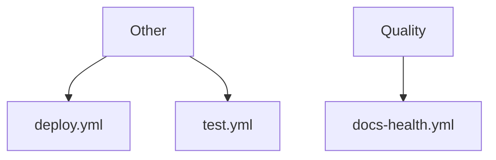

<!-- GENERATED FILE. Do not edit directly. Run npm run docs:diagrams. -->

---
status: generated
owner: platform
doc_type: diagram
fidelity: generated
title: "Factory Workflow Map"
generator: npm run docs:diagrams
last_generated: 2026-07-10
source:
  - .github/workflows/*.yml
  - .github/workflows/REGISTRY.md
---

# Factory Workflow Map

